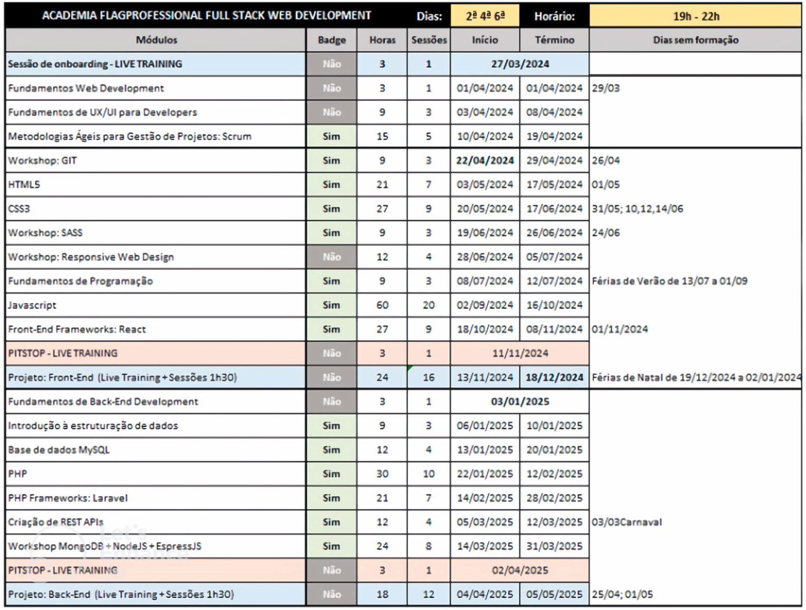

## FLAG - FULL STACK WEB DEVELOPMENT

Links para os grupo:
[WhatsApp](https://chat.whatsapp.com/LjEH7BEsphLCAjIFMhcVzE) | [Discord](https://discord.gg/c7fZ7PVx6v)

### Turma #8491 :

Professor: [Valerio Vaz](https://github.com/vvaz)

**Equipe:**

- [Angelo Santos Dev](https://github.com/AngeloSantosDev)

- [Eraldo Oliveira](https://github.com/eraldo-oliveira)

- [Hugo](https://github.com/hugo-m12)

- [LP Ferreira](https://github.com/LPFerreira)

- [Pedro Franzina](https://github.com/pedrofranzina)

- [V Silva Bruno](https://github.com/vsilvabruno)

- [Gabriel Stroligo](https://github.com/stroligo)

- [Antonio J V Cunha](https://github.com/antoniojvcunha)

- [Marianass Almeida](https://github.com/Marianassalmeida)

##

> [!TIP]
> Livros de apoio: [repositório](/livros/)

## Etapas:

- [x] Sessão de Onboarding

- [x] Fundamentos de Web Development

- [x] Fundamentos de UX/UI

- [x] Metodologias Ágeis para Gestão de Projetos: Scrum

- [] Workshop: GIT

- [] HTML5

- [] CSS3

- [] Workshop

- [] Workshop: Responsive Web Design

- [] Fundamentos de Programação

- [] Javascript

- [] Frontend Frameworks: React

- [] Pitstop

- [] Projeto: Front-End

- [] Fundamentos de Back-End Development

- [] Introdução à estruturação de dados

- [] Bases de dados MySQL

- [] PHP

- [] PHP Frameworks: Laravel

- [] Criação de REST APIs

- [] Workshop: MongoDB + NodeJS + ExpressJS

- [] Pitstop

- [] Projeto: Back-End

## Cronograma

